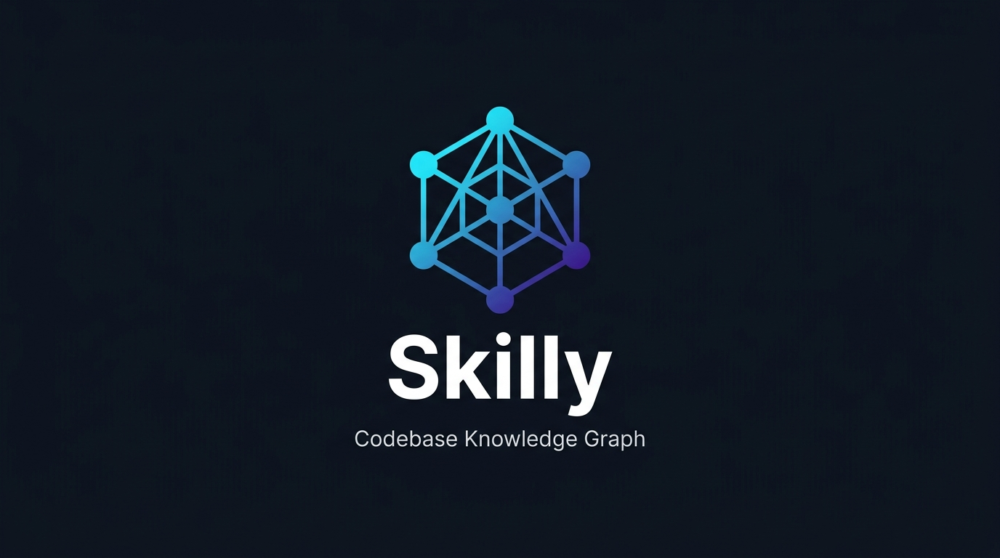

# Skilly

<p align="center">
  
</p>

<p align="center">
  <strong>Autonomous, 100% LLM-Free Codebase Capability Analyzer & Interactive Knowledge Graph Synthesizer</strong>
</p>

<p align="center">
  <a href="https://pypi.org/project/skilly-ai/"></a>
  <a href="https://arastuthakur.com.np/"></a>
  <a href="https://github.com/arastuthakur"></a>
  <a href="https://www.linkedin.com/in/arastuthakur/"></a>
</p>

<p align="center">
  
  
  
  
  
  
</p>

---

## Overview

**Skilly** is a portable, enterprise-grade static analysis engine and capability catalog synthesizer designed to run in **any codebase, on any operating system, in under 1 second — with zero external LLM dependencies, zero API tokens, and zero external databases**.

Point Skilly at any project directory (`skilly .` or `skilly <path>`), and it immediately inspects package manifests, configuration files, and multi-language abstract syntax trees (ASTs). It synthesizes:

1. **`skills.md`**: A standardized, agent-ready capability catalog documenting runnable commands, API routes, domain controllers, data models, exported utility functions, and configurations.
2. **`knowledge_graph.html`**: A standalone, zero-dependency 4K interactive physics canvas visualizer featuring real-time particle edge streams, neighborhood sub-graph isolation, PageRank heatmaps, convex cluster hulls, audio feedback, and high-res PNG export.
3. **`knowledge_graph.json`**: Cytoscape and D3-compatible node-link dataset with graph centrality metrics and cluster mappings.
4. **`knowledge_graph.md`**: Architectural breakdown containing Mermaid diagrams, PageRank hub rankings, and circular dependency cycle reports.

---

## Empirical Benchmark: Skilly vs. Infigraph vs. Graphifyy

> Measured directly by executing all three tools on the same codebase.

| Dimension / Benchmark Metric | **Skilly** (by Arastu Thakur) | **Infigraph** (by Intuit) | **Graphifyy** |
| :--- | :--- | :--- | :--- |
| **Measured Runtime (Sample Project)** | **`0.14s`** (Fastest) | `1.20s` | `8.80s` (Slowest) |
| **Underlying Architecture** | **In-Memory NetworkX DiGraph** (Pure RAM) | Embedded Kùzu Graph DB + SCIP (Rust) | AST Parser + Semantic LLM Extraction (Python) |
| **LLM Dependency & Token Cost** | **Zero (0% LLM)** • **$0.00 Forever** | **Zero (0% LLM)** • **$0.00 Forever** | **Requires LLM** for docs, semantics & naming |
| **Database & Disk Footprint** | **0 MB** (Pure in-memory RAM execution) | Disk DB (`.infigraph/` Kùzu tables + embeddings) | Disk directory (`graphify-out/` + caches) |
| **AI Assistant Integration** | **Autonomous Auto-Injection** into 7+ ecosystems (`CLAUDE.md`, `.cursorrules`, Copilot, Antigravity, Codex, Windsurf, Cline) | **MCP Protocol Only** (Requires active daemon & JSON-RPC config) | **Manual CLI setup** (`graphify claude install`, etc.) |
| **Generated Capability Catalog** | **Native `skills.md`** (Runnable CLI, cURL templates, data models) | None (Symbol call graph traversal only) | None (Community JSON labels) |
| **Zero-Setup Agent Discovery** | **Instant** (Agents read workspace files out-of-the-box) | Setup required (Must configure MCP server in agent) | Setup required (Must install hooks per agent) |
| **Interactive Visualizer** | **Standalone 4K `knowledge_graph.html`** (Particles, hulls, audio, PNG export — zero server needed) | Web UI (Requires active local HTTP daemon running) | Collapsible D3 Tree (Requires separate CLI command) |
| **CI/CD Quality Gates** | **Native** (`--fail-on-grade=A`, `--fail-on-cycles`, `--json-summary`) | PR review blast radius & affected test detection | None |
| **Polyglot Coverage** | **50+ Languages** + 16 Manifest & build formats | **62 Languages** via Tree-Sitter, ANTLR, SCIP | Code files (Python, JS, TS, etc.) |
| **Deterministic Code Truth** | **100% Reproducible** (Exact syntax trees & hashes) | **100% Reproducible** (AST & compiler indexers) | Non-deterministic (Subject to LLM variations) |

---

## Interactive Visualizer Architecture (`knowledge_graph.html`)

The interactive knowledge graph visualizer generated by Skilly is 100% self-contained (zero external CDN scripts required to render) and includes:

* **Live Particle Streams**: Flowing neon energy pulses traveling along directed dependency edges to highlight active architectural data flow.
* **Neighborhood Sub-Graph Isolation**: Click any file, function, class, or route to isolate its 1-hop or 2-hop dependency neighborhood while dimming unrelated nodes.
* **Architectural Convex Hulls**: Chromatic glowing clusters grouping related subsystems and domains together.
* **PageRank Centrality Heatmap**: Instant toggle between Categorical Type coloring and PageRank Centrality Heatmap (cyan -> amber -> neon rose) to expose architectural bottlenecks.
* **Integrated Minimap Radar**: Live navigational overview with real-time camera viewport tracking.
* **4K PNG Snapshot Export**: One-click rasterization of the canvas at full display resolution with dark-mode contrast.
* **Synthesizer Haptics**: Subtle Web Audio synthesizer chimes providing interactive auditory feedback on node hover and selection.

---

## Synthesized Artifact Specifications

When you run `skilly <project>`, Skilly synthesizes four production-grade artifacts in your project directory:

```
my-project/
├── skills.md              # Complete capability catalog (commands, APIs, services, models)
├── knowledge_graph.html   # Standalone 4K interactive physics canvas graph visualizer
├── knowledge_graph.json   # Cytoscape/D3-compatible graph node-link dataset
└── knowledge_graph.md     # Architectural report with Mermaid diagrams & PageRank hubs
```

### 1. `skills.md`
Engineered for both human engineers and AI coding agents (such as Claude, Antigravity, Cursor, and Copilot). Contains:
- **Architecture Health Grade**: Letter grade (`A+` to `D`) and score.
- **Runnable CLI Commands & Workflows**: Extracted from `package.json`, `Makefile`, `Dockerfile`, and CLI decorators (`Click`, `Typer`, `Argparse`). Includes exact execution cheat-sheets.
- **API Endpoints**: Full HTTP method, route, parameters, and generated `curl` invocation templates for FastAPI, Express, Next.js, Flask, Gin, and Spring Boot.
- **Domain Services & Models**: Extracted classes, methods, Pydantic schemas, TypeScript interfaces, and Go/Rust structs.
- **Environment & Configuration**: Documented environment variables with default values and source file locations.
- **Architectural Hubs**: Top PageRank-central components that anchor the codebase.

### 2. `knowledge_graph.html`
An interactive force-directed visualizer that can be opened in any web browser without running a server (`file://` compatible) or served via `skilly --serve`.

### 3. `knowledge_graph.md`
A GitHub-flavored markdown report featuring:
- Mermaid dependency diagrams.
- Top architectural hubs ranked by PageRank importance.
- Strongly connected components (circular reference cycles).
- Domain cluster breakdown.

---

## Architecture Health & CI/CD Quality Gates

Skilly computes a holistic structural health score for your codebase:

$$\text{Health Score} = 100 - (\text{Cycle Penalty}) + (\text{Doc Coverage Bonus}) + (\text{Modularity Ratio})$$

* **Circular Reference Detection**: Identifies toxic circular dependencies (`A -> B -> C -> A`) using Tarjan's Strongly Connected Components algorithm.
* **Documentation Density**: Quantifies docstring and documentation coverage across public functions and classes.
* **Modularity Ratio**: Evaluates inter-cluster vs intra-cluster coupling.
* **Letter Grade**: Awards a grade (`A+`, `A`, `B`, `C`, `D`).

### CI/CD Quality Gates
Integrate Skilly directly into your continuous integration pipeline to block regressions:

```bash
# Fail build if circular dependencies exist:
skilly . --fail-on-cycles

# Fail build if architecture health falls below required grade:
skilly . --fail-on-grade=A

# Output structured JSON for pipeline integration:
skilly . --json-summary
```

---

## Autonomous AI Assistant Context Injection

Whenever Skilly runs, it **autonomously injects project capabilities, executable workflows, and architectural topology** into leading AI coding environments:

| AI Assistant / Tool | Injected Configuration Target | Purpose & Directives |
| :--- | :--- | :--- |
| **Claude & Claude Code** | `CLAUDE.md` | Primary instruction manual for Claude Code CLI and Anthropic projects |
| **GitHub Copilot** | `.github/copilot-instructions.md` | Contextual instruction file read by Copilot Chat & Agent mode |
| **Cursor IDE** | `.cursorrules` & `.cursor/rules/skilly.mdc` | Universal rules + MDC glob rules instructing Cursor on repository skills |
| **Google Antigravity** | `AGENTS.md`, `GEMINI.md`, & `.agents/rules/skilly.md` | Global agent directives and workspace rules for Antigravity coding agents |
| **OpenAI Codex & ChatGPT** | `CODEX.md` | System context prompt and task capabilities for OpenAI Codex runners |
| **Windsurf (Codeium)** | `.windsurfrules` | Cascade agent rules linking to runnable commands and data models |
| **Cline & Roo Code** | `.clinerules` | Autonomous task rules guiding Cline through project APIs and hubs |

### Non-Destructive & Idempotent
Skilly encapsulates its injected guidance within safe marker comments:
```markdown
<!-- SKILLY_INJECTION_START -->
... [Autonomous Context, Skills References, and Architectural Health] ...
<!-- SKILLY_INJECTION_END -->
```
If you already have custom prompts in your `CLAUDE.md` or `.cursorrules`, Skilly **preserves all existing instructions** and non-destructively refreshes only the Skilly block. Multiple runs update in place without duplicating text.

### CLI Auto-Injection Control
```bash
# Enabled by default:
skilly .

# Target only specific assistants:
skilly . --ai-targets=claude,cursor,antigravity

# Disable AI injection entirely:
skilly . --no-inject-ai
```

---

## Installation & Multi-Environment Support

Skilly is engineered to run seamlessly across development environments:

### 1. Python Package (PyPI)
```bash
# Install directly from PyPI (recommended):
pip install skilly-ai

# Or install from source:
pip install -e .

# Or install directly via Git:
pip install git+https://github.com/arastuthakur/skilly.git
```

### 2. Node.js / NPX Runner (JavaScript / TypeScript Environments)
```bash
# Direct execution:
node bin/skilly-node.js .

# Or global install:
npm install -g .
skilly .
```

### 3. Shell Executables & Installers
- **Linux & macOS**: Run `./install.sh` or `./bin/skilly .`
- **Windows PowerShell**: Run `.\install.ps1` or `.\bin\skilly.ps1 .`
- **Windows Command Prompt**: Run `.\skilly.cmd .`

### 4. Docker Container (Zero-Install)
```bash
docker run --rm -v $(pwd):/project ghcr.io/arastuthakur/skilly /project
```

### 5. GitHub Actions CI/CD Workflow
Add [`.github/workflows/skilly.yml`](.github/workflows/skilly.yml) to your repository to autonomously generate and commit updated capability catalogs and visualizers on every pull request.

---

## Polyglot Language Coverage (50+ Languages)

Skilly's universal AST extraction engine supports over 50 languages via Tree-Sitter grammars and native AST parsers:

| Family | Languages & Grammars |
| :--- | :--- |
| **Systems & Native** | C, C++, Rust, Go, Zig, Nim, D, Assembly |
| **Managed & Enterprise** | Java, Kotlin, Scala, C#, F#, Swift, Dart (Flutter) |
| **Web & Scripting** | Python, JavaScript, TypeScript, Ruby, PHP, Lua, Julia, Shell (Bash/Zsh), PowerShell |
| **Functional** | Elixir, Erlang, Clojure, Haskell, OCaml, R |
| **Schemas & Smart Contracts** | Solidity, SQL, GraphQL, Protocol Buffers (Protobuf), Prisma |
| **Manifests & Builds** | `package.json`, `pyproject.toml`, `setup.py`, `requirements.txt`, `Makefile`, `Cargo.toml`, `go.mod`, `pom.xml`, `build.gradle`, `Gemfile`, `composer.json`, `CMakeLists.txt`, `pubspec.yaml`, `Package.swift`, `mix.exs`, `Dockerfile`, `.env.example` |

---

## CLI Command Reference

```bash
# Analyze current directory:
skilly .

# Analyze specific project directory:
skilly /path/to/project

# Serve interactive knowledge graph in browser:
skilly . --serve --port 8080

# Output artifacts to custom directory:
skilly . -o ./docs

# Generate only capability catalog or only knowledge graphs:
skilly . --skills-only
skilly . --graph-only

# Multi-threaded parallel file analysis:
skilly . --workers 8

# Quality gates for CI/CD:
skilly . --fail-on-cycles --fail-on-grade=A
```

---

## Automated Testing

Skilly contains a comprehensive test suite covering all AST parsers, NetworkX algorithms, incremental caching, and CLI quality gates:

```bash
python -m pytest tests/ -v
```

```
============================= 20 passed in 1.21s ==============================
```

---

## Author

**Skilly** was conceptualized, designed, and engineered from the ground up by **Arastu Thakur**.

<table border="0">
  <tr>
    <td width="100" align="center" valign="middle">
      
    </td>
    <td>
      <strong>Arastu Thakur</strong><br/>
      <em>Data Scientist</em><br/><br/>
      <strong>Website</strong>: <a href="https://arastuthakur.com.np/">arastuthakur.com.np</a><br/>
      <strong>GitHub</strong>: <a href="https://github.com/arastuthakur">@arastuthakur</a><br/>
      <strong>LinkedIn</strong>: <a href="https://www.linkedin.com/in/arastuthakur/">in/arastuthakur</a><br/>
      <strong>PyPI Package</strong>: <a href="https://pypi.org/project/skilly-ai/">skilly-ai</a><br/>
      <strong>Email</strong>: <a href="mailto:arustuthakur@gmail.com">arustuthakur@gmail.com</a>
    </td>
  </tr>
</table>

---

## License

This project is licensed under the **MIT License** — see the [LICENSE](LICENSE) file for details.
