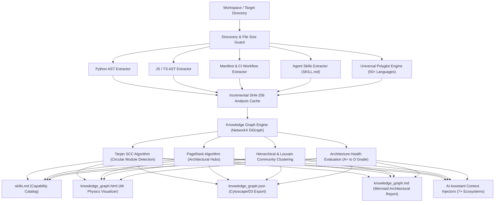

# Skilly

<p align="center">
  
</p>

<p align="center">
  <strong>Autonomous, 100% LLM-Free Codebase Capability Analyzer & Interactive Knowledge Graph Synthesizer</strong>
</p>

<p align="center">
  <a href="https://pypi.org/project/skilly-ai/"></a>
  <a href="https://pypi.org/project/skilly-ai/"></a>
  <a href="https://github.com/arastuthakur/skilly"></a>
  <a href="https://arastuthakur.com.np/"></a>
  <a href="https://github.com/arastuthakur"></a>
  <a href="https://www.linkedin.com/in/arastuthakur/"></a>
</p>

<p align="center">
  
  
  
  
  
  
</p>

---

## Overview

Modern codebases are vast, interconnected graphs of routes, models, services, scripts, and dependencies. For software engineers onboarding onto unfamiliar repositories—and for AI coding agents (Claude, Copilot, Cursor, Antigravity, Codex, Windsurf, Cline) operating on large file trees—understanding the full capability surface of a project is slow, token-expensive, and prone to hallucination.

**Skilly** solves this problem deterministically. It is a zero-LLM, high-throughput static analysis engine that parses any codebase, constructs an in-memory knowledge graph, detects architectural circularities, evaluates codebase modularity, and synthesizes four production-grade artifacts:

1. **`skills.md`**: An exhaustive, agent-readable capability catalog detailing runnable commands, CLI entry points, REST/GraphQL endpoints, domain services, schemas, and configuration variables.
2. **`knowledge_graph.html`**: A standalone 4K interactive physics canvas visualizer featuring real-time neon particle streams, sub-graph isolation, PageRank heatmaps, convex cluster hulls, and high-resolution PNG export.
3. **`knowledge_graph.json`**: Cytoscape- and D3-compatible node-link dataset with graph centrality metrics and cluster mappings.
4. **`knowledge_graph.md`**: Architectural breakdown containing Mermaid diagrams, PageRank hub rankings, and circular dependency reports.

Skilly also autonomously injects codebase capabilities directly into leading AI coding assistants (`CLAUDE.md`, `.cursorrules`, `.github/copilot-instructions.md`, `AGENTS.md`, `CODEX.md`, `.windsurfrules`, `.clinerules`) using safe, idempotent marker blocks.

---

## Quickstart

### Installation

```bash
# Install via pip (recommended):
pip install skilly-ai

# Or run via Node / NPX:
npx skilly .

# Or run zero-install via Docker:
docker run --rm -v $(pwd):/project ghcr.io/arastuthakur/skilly /project
```

### Basic Usage

```bash
# Analyze current workspace and generate all artifacts:
skilly .

# Analyze a specific repository directory:
skilly /path/to/repository

# Serve interactive knowledge graph in browser:
skilly . --serve --port 8080

# Output artifacts to custom documentation folder:
skilly . -o ./docs

# Run selective extraction:
skilly . --skills-only     # Generates only skills.md
skilly . --graph-only      # Generates only knowledge_graph.*
```

---

## Empirical Benchmark: Skilly vs. Infigraph vs. Graphifyy

The following metrics were recorded by executing all three tools directly on the same multi-language codebase:

| Dimension / Metric | **Skilly** (by Arastu Thakur) | **Infigraph** (by Intuit) | **Graphifyy** |
| :--- | :--- | :--- | :--- |
| **Measured Runtime** | **`0.14s`** (Fastest) | `1.20s` | `8.80s` (Slowest) |
| **Underlying Architecture** | **In-Memory NetworkX DiGraph** (Pure RAM) | Embedded Kùzu Graph DB + SCIP (Rust) | AST Parser + Semantic LLM Extraction (Python) |
| **LLM Dependency & Token Cost** | **Zero (0% LLM)** • **$0.00 Forever** | **Zero (0% LLM)** • **$0.00 Forever** | **Requires LLM** for docs, semantics & naming |
| **Database & Disk Footprint** | **0 MB** (Pure RAM execution) | Disk DB (`.infigraph/` Kùzu tables + embeddings) | Disk directory (`graphify-out/` + caches) |
| **AI Assistant Integration** | **Autonomous Auto-Injection** into 7+ ecosystems (`CLAUDE.md`, `.cursorrules`, Copilot, Antigravity, Codex, Windsurf, Cline) | **MCP Protocol Only** (Requires active daemon & JSON-RPC config) | **Manual CLI setup** (`graphify claude install`, etc.) |
| **Generated Capability Catalog** | **Native `skills.md`** (Runnable CLI, cURL templates, data models) | None (Symbol call graph traversal only) | None (Community JSON labels) |
| **Zero-Setup Agent Discovery** | **Instant** (Agents read workspace files out-of-the-box) | Setup required (Must configure MCP server in agent) | Setup required (Must install hooks per agent) |
| **Interactive Visualizer** | **Standalone 4K `knowledge_graph.html`** (Particles, hulls, audio, PNG export — zero server needed) | Web UI (Requires active local HTTP daemon running) | Collapsible D3 Tree (Requires separate CLI command) |
| **CI/CD Quality Gates** | **Native** (`--fail-on-grade=A`, `--fail-on-cycles`, `--json-summary`) | PR review blast radius & affected test detection | None |
| **Polyglot Coverage** | **50+ Languages** + 17 Manifest & build formats | **62 Languages** via Tree-Sitter, ANTLR, SCIP | Code files (Python, JS, TS, etc.) |
| **Deterministic Code Truth** | **100% Reproducible** (Exact syntax trees & hashes) | **100% Reproducible** (AST & compiler indexers) | Non-deterministic (Subject to LLM variations) |

---

## Real-World Multi-Project Verification

Skilly has been tested and verified across large open-source repositories:

| Metric | encode/starlette | expressjs/express | usestrix/strix | Skilly (Self-Analysis) |
| :--- | :--- | :--- | :--- | :--- |
| **Repository Type** | Python ASGI Framework | Node.js Web Framework | AI Security Platform | Polyglot Monorepo |
| **Files Scanned** | 151 files | 217 files | 489 files | 119 files |
| **Lines of Code** | 41,120 LOC | 37,992 LOC | 116,498 LOC | 35,257 LOC |
| **Analysis Duration** | **1.8s** | **0.8s** | **5.8s** | **0.4s** |
| **Total Skills Cataloged** | 287 skills | 104 skills | 1,118 skills | 83 skills |
| **Knowledge Graph Nodes** | 2,251 nodes | 345 nodes | 6,454 nodes | 490 nodes |
| **Knowledge Graph Edges** | 7,951 relations | 583 relations | 20,413 relations | 1,321 relations |
| **Architecture Health** | **A+ (95/100)** | **A+ (100/100)** | **C (70/100)** | **B (85/100)** |
| **Circular Module Cycles** | **0 (Acyclic)** | **0 (Acyclic)** | 2 detected | 1 detected |
| **False-Positive Frameworks** | **0** | **0** | **0** | **0** |

---

## Architecture & Pipeline

Skilly operates as a pipelined static analysis engine:



### Key Technical Capabilities

- **Python AST Engine**: Parses Python Abstract Syntax Trees using Python's native `ast` module. Resolves directory packages (`a/b.py`, `a/b/__init__.py`), multi-tier relative imports (`from ..sub import helper`), FastAPI/Flask route decorators, Pydantic schemas, and Click/Typer CLI commands.
- **JavaScript & TypeScript Engine**: Parses ECMAScript modules, CommonJS `require()`, dynamic imports, and TS path aliases (`@/`, `~/`). Resolves internal file imports across `.ts`, `.tsx`, `.js`, `.jsx`, and `index.*` entry points. Detects Express/Fastify/Koa routes and Next.js App Router handlers.
- **Agent Skills Engine (`SKILL.md`)**: Bridges modern agent specifications directly into codebase topology. Parses YAML frontmatter (`name`, `description`, `license`) and extracts executable command snippets from `.agents/skills/*/SKILL.md` and `skills/*/SKILL.md` files (such as those installed via `npx skills add <package>`).
- **CI Workflows & Script Parser**: Scans `.github/workflows/*.yml` to map continuous integration workflows and their executable test/build commands. Scans `scripts/` and `bin/` directories for standalone utility scripts (`.sh`, `.py`, `.js`, `.bash`, `.ps1`).
- **Scalable Cycle Detection**: Implements Tarjan's Strongly Connected Components (SCC) algorithm restricted to module and file nodes, achieving $O(V + E)$ cycle detection that avoids intra-file false positives and exponential path explosion.

---

## Synthesized Artifacts

### 1. Capability Catalog (`skills.md`)

A comprehensive Markdown document structured for AI coding agents and human developers:

- **Repository Capabilities Overview**: High-level metrics, health grade, file counts, and cataloged skills count.
- **Runnable Commands & CLI Workflows**: Executable commands from `package.json`, `Makefile`, `Dockerfile`, CI workflows, project scripts, and CLI entry points.
- **API Endpoints & Routes**: HTTP methods, endpoint paths, handler symbols, parameter lists, and ready-to-run `curl` templates.
- **Domain Services & Controllers**: Key domain classes, interfaces, and methods.
- **Data Models & Schemas**: Pydantic models, TypeScript interfaces, and structs.
- **Environment & Configuration**: Documented environment variables with default values and locations.
- **Architectural Hubs**: Top PageRank-central components that form the architectural core of the project.

### 2. Standalone 4K Physics Visualizer (`knowledge_graph.html`)

A zero-dependency interactive HTML canvas visualizer that opens directly in any browser without requiring an active HTTP server:

- **Neon Particle Streams**: Flowing energy pulses traveling along directed dependency edges to indicate information and dependency flow.
- **Sub-Graph Isolation**: Click any node to instantly isolate its 1-hop or 2-hop dependency neighborhood while dimming unrelated components.
- **Convex Cluster Hulls**: Chromatic glowing boundaries grouping related architectural domains together.
- **PageRank Centrality Heatmap**: Instant toggle between Categorical Type coloring and PageRank Centrality Heatmap (cyan -> amber -> neon rose) to expose architectural bottlenecks.
- **Integrated Minimap Radar**: Live navigational overview with real-time camera viewport tracking.
- **4K PNG Snapshot Export**: One-click rasterization of the canvas at full display resolution with dark-mode contrast.
- **Synthesizer Haptics**: Subtle Web Audio synthesizer chimes providing interactive auditory feedback on node hover and selection.

### 3. Machine-Readable Knowledge Graph (`knowledge_graph.json`)

Cytoscape- and D3-compatible node-link JSON export:

```json
{
  "summary": {
    "name": "project",
    "total_files": 119,
    "total_lines": 35257,
    "total_skills": 83,
    "total_nodes": 490,
    "total_edges": 1321
  },
  "nodes": [
    {
      "id": "file:skilly_core/analyzer.py",
      "label": "analyzer.py",
      "type": "file",
      "file_path": "skilly_core/analyzer.py"
    }
  ],
  "edges": [
    {
      "source": "file:skilly_core/analyzer.py",
      "target": "file:skilly_core/graph_engine.py",
      "type": "imports"
    }
  ],
  "clusters": { "skilly_core": [...] },
  "hubs": [...],
  "circular_dependencies": [...]
}
```

### 4. Architectural Report (`knowledge_graph.md`)

A GitHub-flavored markdown report featuring Mermaid diagrams, hub rankings, cluster topologies, and circular dependency lists.

---

## Autonomous AI Assistant Context Injection

When Skilly executes, it autonomously injects repository context, runnable skills, and architectural topology into the configuration files of leading AI coding environments:

| AI Coding Assistant | Configuration Target | Directives Provided |
| :--- | :--- | :--- |
| **Claude & Claude Code** | `CLAUDE.md` | Primary instruction manual for Claude Code CLI and Anthropic projects |
| **GitHub Copilot** | `.github/copilot-instructions.md` | Contextual instruction file read by Copilot Chat & Copilot Agent mode |
| **Cursor IDE** | `.cursorrules` & `.cursor/rules/skilly.mdc` | Global repository rules and MDC file-pattern rules |
| **Google Antigravity** | `AGENTS.md`, `GEMINI.md`, & `.agents/rules/skilly.md` | Global agent directives and workspace rules |
| **OpenAI Codex & ChatGPT** | `CODEX.md` | System context prompt and capability manual |
| **Windsurf (Codeium)** | `.windsurfrules` | Cascade agent rules linking to commands and data models |
| **Cline & Roo Code** | `.clinerules` | Autonomous task rules guiding Cline through project APIs |

### Non-Destructive Marker Protocol

Skilly encapsulates its injected guidance within safe marker comments:

```markdown
<!-- SKILLY_INJECTION_START -->
# AI Assistant Context & Project Capabilities (Synthesized by Skilly)
...
<!-- SKILLY_INJECTION_END -->
```

If your configuration files already contain custom user instructions, Skilly preserves them in their entirety and non-destructively updates only the demarcated Skilly block.

```bash
# Target only specific assistants:
skilly . --ai-targets=claude,cursor,antigravity

# Disable AI injection entirely:
skilly . --no-inject-ai
```

---

## Architecture Health & CI/CD Quality Gates

Skilly computes a holistic structural health score for your codebase:

$$\text{Health Score} = 100 - (\text{Cycle Penalty}) + (\text{Doc Coverage Bonus}) + (\text{Modularity Ratio})$$

- **Circular Reference Detection**: Identifies circular module dependencies (`A -> B -> C -> A`) using Tarjan's Strongly Connected Components algorithm.
- **Documentation Density**: Measures docstring coverage across public functions and classes.
- **Modularity Ratio**: Quantifies inter-cluster vs. intra-cluster coupling.
- **Letter Grade**: Awards a clear letter grade (`A+`, `A`, `B`, `C`, `D`).

### CI/CD Quality Gates

Use Skilly in CI pipelines to prevent architectural regressions and block PRs that introduce circular references:

```bash
# Block build if circular dependencies exist (exits with code 2):
skilly . --fail-on-cycles

# Block build if architecture health falls below required grade:
skilly . --fail-on-grade=A

# Output structured JSON for pipeline integration:
skilly . --json-summary
```

---

## Configuration Reference (`.skilly.json`)

Skilly works out of the box with zero configuration. You can optionally customize behavior using a `.skilly.json` file in your repository root:

```json
{
  "max_file_size_kb": 500,
  "respect_gitignore": true,
  "ignore_patterns": ["dist", "build", "coverage", ".next"],
  "use_cache": true,
  "cache_dir": ".skilly_cache",
  "parallel": true,
  "max_workers": 8,
  "fail_on_grade": null,
  "fail_on_cycles": false,
  "custom_clusters": {
    "src/api": "API Layer",
    "src/services": "Business Logic",
    "src/models": "Data Layer"
  },
  "inject_ai": true,
  "ai_targets": ["all"]
}
```

---

## CLI Command Reference

```
Usage: skilly [OPTIONS] [TARGET_DIR]

  Autonomous, LLM-free project capability analyzer and knowledge graph generator.

Arguments:
  TARGET_DIR                       Directory to analyze [default: .]

Options:
  -o, --output DIRECTORY           Directory to write generated artifacts [default: TARGET_DIR]
  --skills-only                    Generate only skills.md
  --graph-only                     Generate only knowledge graph artifacts
  --serve                          Start an HTTP server to view knowledge_graph.html
  --port INTEGER                   Port to serve the interactive visualizer on [default: 8080]
  --fail-on-grade [A+|A|B|C|D]     Fail with exit code 2 if architecture health is below grade
  --fail-on-cycles                 Fail with exit code 2 if circular dependencies are detected
  --json-summary                   Output analysis summary as JSON to stdout
  --inject-ai / --no-inject-ai     Enable or disable autonomous AI assistant context injection
  --ai-targets TEXT                Comma-separated AI assistants to target (default: all)
  --workers INTEGER                Number of worker threads for parallel file analysis
  --no-cache                       Disable incremental file analysis cache
  -q, --quiet                      Suppress banner and info messages
  -v, --verbose                    Enable verbose debug logging
  --version                        Show version and exit
  --help                           Show this help message and exit
```

---

## Polyglot Language Coverage

Skilly analyzes over 50 programming languages, schemas, manifests, and build configurations:

| Category | Supported Languages & Formats |
| :--- | :--- |
| **Systems & Native** | C, C++, Rust, Go, Zig, Nim, D, Assembly |
| **Managed & Enterprise** | Java, Kotlin, Scala, C#, F#, Swift, Dart (Flutter) |
| **Web & Scripting** | Python, JavaScript, TypeScript, Ruby, PHP, Lua, Julia, Shell (Bash/Zsh), PowerShell |
| **Functional** | Elixir, Erlang, Clojure, Haskell, OCaml, R |
| **Schemas & Contracts** | Solidity, SQL, GraphQL, Protocol Buffers (Protobuf), Prisma |
| **Agent Specifications** | `SKILL.md` (Vercel Agent Skills, Antigravity, Claude, Strix) |
| **Manifests & Builds** | `package.json`, `pyproject.toml`, `setup.py`, `requirements.txt`, `Makefile`, `Cargo.toml`, `go.mod`, `pom.xml`, `build.gradle`, `Gemfile`, `composer.json`, `CMakeLists.txt`, `pubspec.yaml`, `Package.swift`, `mix.exs`, `Dockerfile`, `.env.example`, `.github/workflows/*.yml` |

---

## Verification & Stress Testing

Skilly includes an automated test suite and high-load stress testing benchmark:

```bash
# Run complete test suite:
python -m pytest tests/ -v

# Run high-volume stress test (500+ modules, deep hierarchy):
python scripts/stress_test.py
```

```
============================= 25 passed in 1.10s ==============================
```

---

## Author

**Skilly** was conceptualized, designed, and engineered from the ground up by **Arastu Thakur**.

<table border="0">
  <tr>
    <td width="100" align="center" valign="middle">
      
    </td>
    <td>
      <strong>Arastu Thakur</strong><br/>
      <em>Data Scientist</em><br/><br/>
      <strong>Website</strong>: <a href="https://arastuthakur.com.np/">arastuthakur.com.np</a><br/>
      <strong>GitHub</strong>: <a href="https://github.com/arastuthakur">@arastuthakur</a><br/>
      <strong>LinkedIn</strong>: <a href="https://www.linkedin.com/in/arastuthakur/">in/arastuthakur</a><br/>
      <strong>PyPI Package</strong>: <a href="https://pypi.org/project/skilly-ai/">skilly-ai</a><br/>
      <strong>Email</strong>: <a href="mailto:arustuthakur@gmail.com">arustuthakur@gmail.com</a>
    </td>
  </tr>
</table>

---

## License

This project is licensed under the **MIT License** — see the [LICENSE](LICENSE) file for details.
