# Knowledge Graph Architecture: skilly-ai

> Structural and semantic topology extracted deterministically via AST and import graphs.

## 📈 Graph Metrics
- **Total Entities (Nodes)**: `432`
- **Total Relationships (Edges)**: `1293`
- **Architectural Clusters**: `5`
- **Circular Dependency Cycles**: `0`

**No circular dependency cycles detected.** Codebase dependency graph is acyclic.

## Architectural Clusters & Subdomains

### Skilly_core Domain (`349` components)
- **Key Components**: `get_text`, `split`, `_extract_calls`, `tests/test_graph_engine.py`, `UniversalPolyglotExtractor._regex_fallback_extract`, `result`, `upper`, `any`, `compute_health_report`, `visit`
- _...and 339 more components_

### Tests Domain (`75` components)
- **Key Components**: `write_artifacts`, `AnalysisCache`, `Panel`, `test_javascript_relative_import_edges`, `test_framework_detection_no_false_positives`, `test_github_workflows_and_scripts_skills`, `AnalysisCache.save`, `keys`, `test_manifest_extractor_makefile_and_env`, `mkdir`
- _...and 65 more components_

### Root Domain (`6` components)
- **Key Components**: `setup.py`, `setuptools`, `start`, `test`, `skilly`, `install.sh`

### .github Domain (`1` components)
- **Key Components**: `generate_project_skills___knowledge_graph`

### Scripts Domain (`1` components)
- **Key Components**: `stress_test_py`

## High-Level Module Architecture Diagram

```mermaid
graph TD
    file_setup_py["setup.py (file)"]
    file_skilly_py["skilly.py (file)"]
    file_scripts_stress_test_py["stress_test.py (file)"]
    file_skilly_core_analyzer_py["analyzer.py (file)"]
    file_skilly_core_cache_py["cache.py (file)"]
    file_skilly_core_cli_py["cli.py (file)"]
    file_skilly_core_config_py["config.py (file)"]
    file_skilly_core_graph_engine_py["graph_engine.py (file)"]
    file_skilly_core_models_py["models.py (file)"]
    file_skilly_core___init___py["__init__.py (file)"]
    file_skilly_core_extractors_base_py["base.py (file)"]
    file_skilly_core_extractors_javascript_extractor_py["javascript_extractor.py (file)"]
    file_skilly_core_extractors_manifest_extractor_py["manifest_extractor.py (file)"]
    file_skilly_core_extractors_polyglot_extractor_py["polyglot_extractor.py (file)"]
    file_skilly_core_extractors_python_extractor_py["python_extractor.py (file)"]
    Path["Path (module)"]
    len["len (module)"]
    append["append (module)"]
    str["str (module)"]
    replace["replace (module)"]
    Skill["Skill (module)"]
    GraphNode["GraphNode (module)"]
    isinstance["isinstance (module)"]
    _rel["_rel (module)"]
    file_skilly_py -->|imports| file_skilly_core_cli_py
    file_scripts_stress_test_py -->|imports| file_skilly_core_analyzer_py
    file_scripts_stress_test_py -->|imports| file_skilly_core_config_py
    file_skilly_core_analyzer_py -->|imports| file_skilly_core_extractors_manifest_extractor_py
    file_skilly_core_analyzer_py -->|imports| file_skilly_core_extractors_python_extractor_py
    file_skilly_core_analyzer_py -->|imports| file_skilly_core_extractors_javascript_extractor_py
    file_skilly_core_analyzer_py -->|imports| file_skilly_core_extractors_polyglot_extractor_py
    file_skilly_core_analyzer_py -->|imports| file_skilly_core_graph_engine_py
    file_skilly_core_analyzer_py -->|imports| file_skilly_core_models_py
    file_skilly_core_analyzer_py -->|imports| file_skilly_core_config_py
    file_skilly_core_analyzer_py -->|imports| file_skilly_core_cache_py
    file_skilly_core_cache_py -->|imports| file_skilly_core_models_py
    file_skilly_core_cli_py -->|imports| file_skilly_core___init___py
    file_skilly_core_cli_py -->|imports| file_skilly_core_analyzer_py
    file_skilly_core_graph_engine_py -->|imports| file_skilly_core_models_py
    file_skilly_core___init___py -->|imports| file_skilly_core_analyzer_py
    file_skilly_core___init___py -->|imports| file_skilly_core_models_py
    file_skilly_core_extractors_base_py -->|imports| file_skilly_core_models_py
    file_skilly_core_extractors_javascript_extractor_py -->|imports| file_skilly_core_extractors_base_py
    file_skilly_core_extractors_javascript_extractor_py -->|imports| file_skilly_core_models_py
    file_skilly_core_extractors_manifest_extractor_py -->|imports| file_skilly_core_extractors_base_py
    file_skilly_core_extractors_manifest_extractor_py -->|imports| file_skilly_core_models_py
    file_skilly_core_extractors_polyglot_extractor_py -->|imports| file_skilly_core_extractors_base_py
    file_skilly_core_extractors_polyglot_extractor_py -->|imports| file_skilly_core_models_py
    file_skilly_core_extractors_python_extractor_py -->|imports| file_skilly_core_extractors_base_py
```

## Central Architectural Hubs (PageRank)

| Rank | Symbol / Module | Type | PageRank | In-Degree | Out-Degree | Impact / Blast Radius |
| :--- | :--- | :--- | :--- | :--- | :--- | :--- |
| #1 | `append` | `module` | `0.0111` | `45` | `0` | Critical Choke Point |
| #2 | `str` | `module` | `0.0092` | `17` | `0` | Critical Choke Point |
| #3 | `GraphNode` | `module` | `0.0089` | `37` | `0` | Critical Choke Point |
| #4 | `Path` | `module` | `0.0083` | `24` | `0` | Critical Choke Point |
| #5 | `isinstance` | `module` | `0.0081` | `13` | `0` | Critical Choke Point |
| #6 | `Skill` | `module` | `0.0080` | `31` | `0` | Critical Choke Point |
| #7 | `_rel` | `module` | `0.0075` | `27` | `0` | Critical Choke Point |
| #8 | `len` | `module` | `0.0074` | `27` | `0` | Critical Choke Point |
| #9 | `replace` | `module` | `0.0070` | `12` | `0` | Critical Choke Point |
| #10 | `models.py` | `file` | `0.0067` | `19` | `18` | Critical Choke Point |
| #11 | `lower` | `module` | `0.0063` | `24` | `0` | Critical Choke Point |
| #12 | `write_text` | `module` | `0.0059` | `17` | `0` | Critical Choke Point |
| #13 | `read_text` | `module` | `0.0058` | `23` | `0` | Critical Choke Point |
| #14 | `round` | `module` | `0.0057` | `2` | `0` | High Importance |
| #15 | `ProjectAnalyzer` | `module` | `0.0056` | `15` | `0` | Critical Choke Point |

## Relationship Types Distribution

| Relationship Type | Count | Description |
| :--- | :--- | :--- |
| `calls` | `903` | Inter-component connection |
| `exposes` | `233` | Inter-component connection |
| `imports` | `143` | Inter-component connection |
| `inherits` | `12` | Inter-component connection |
| `depends_on` | `2` | Inter-component connection |

---
*Interactive visual graph available in `knowledge_graph.html`*